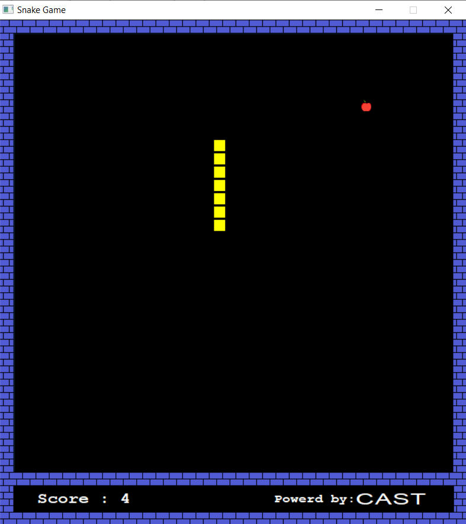
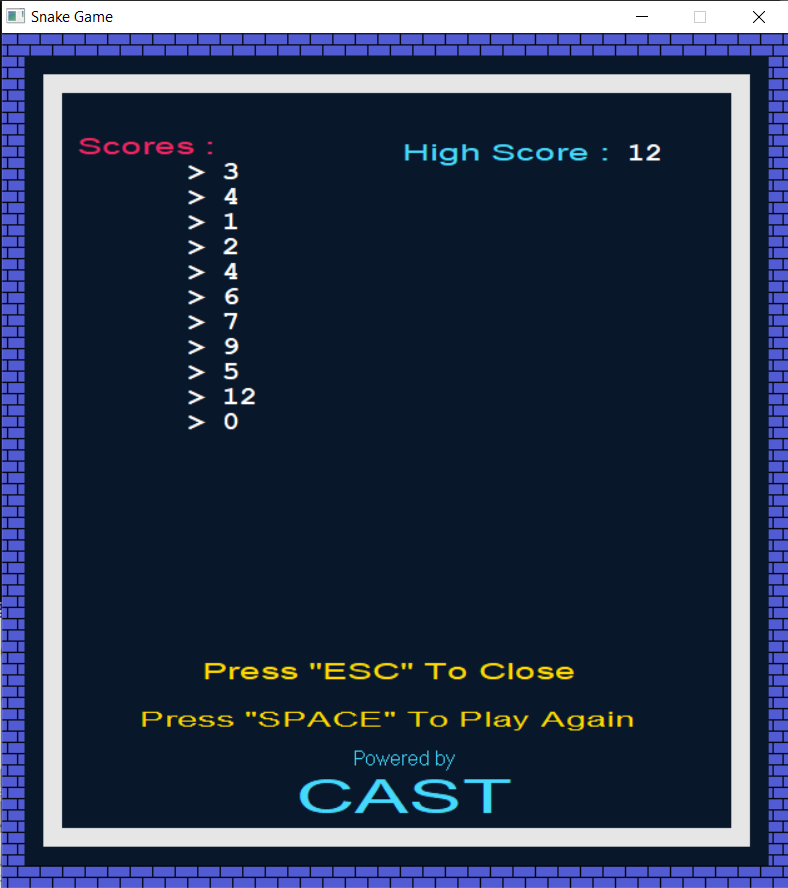

# Snake Game
#### A Snake Game using the C++ graphics.h library
* New features were added

## Developers :
* [Ali Elshorpagi](https://github.com/Ali-Elshorpagi)
* [Amr Elbaz](https://github.com/AmrAlbaz-34)

## How to run the game immediately ?
#### Go to the [Debug Folder](https://github.com/Ali-Elshorpagi/Snake_Game/tree/main/Snake_Game/bin) and download it and run the Sanke_Game.exe file inside it.

* [Gameplay video](https://www.youtube.com/watch?v=dQCAPSQ1mz0)
***** With Old Version

## Start Game

## Game Play

## End Game

## Scores Window

